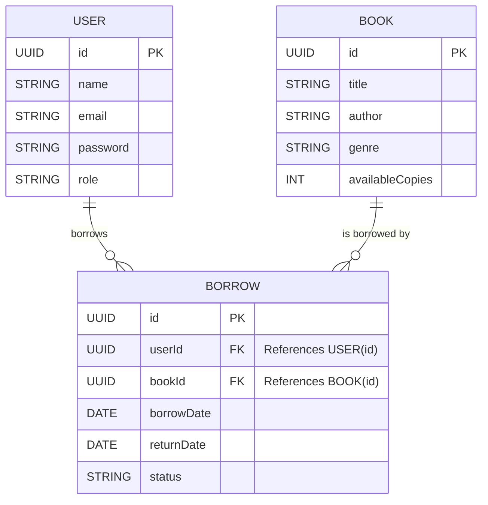

# Entity-Relationship Diagram

```mermaid
erDiagram
    USER {
        UUID id PK
        STRING name
        STRING email
        STRING password
        STRING role
    }

    BOOK {
        UUID id PK
        STRING title
        STRING author
        STRING genre
        INT availableCopies
    }

    BORROW {
        UUID id PK
        UUID userId FK "References USER(id)"
        UUID bookId FK "References BOOK(id)"
        DATE borrowDate
        DATE returnDate
        STRING status
    }

    USER ||--o{ BORROW : "borrows"
    BOOK ||--o{ BORROW : "is borrowed by"

```