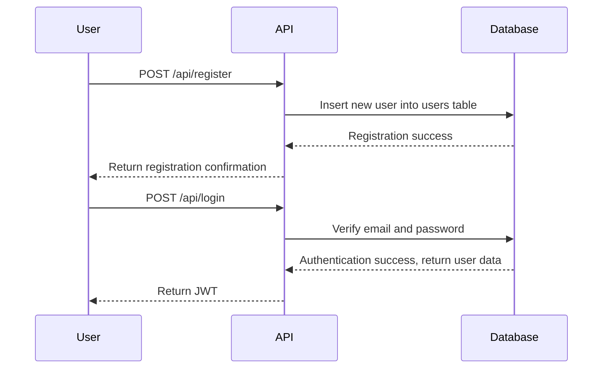
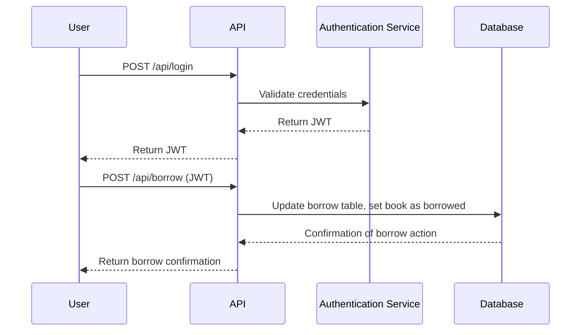
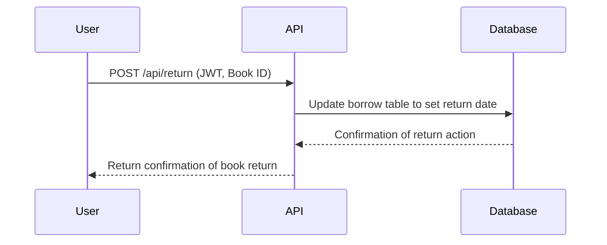
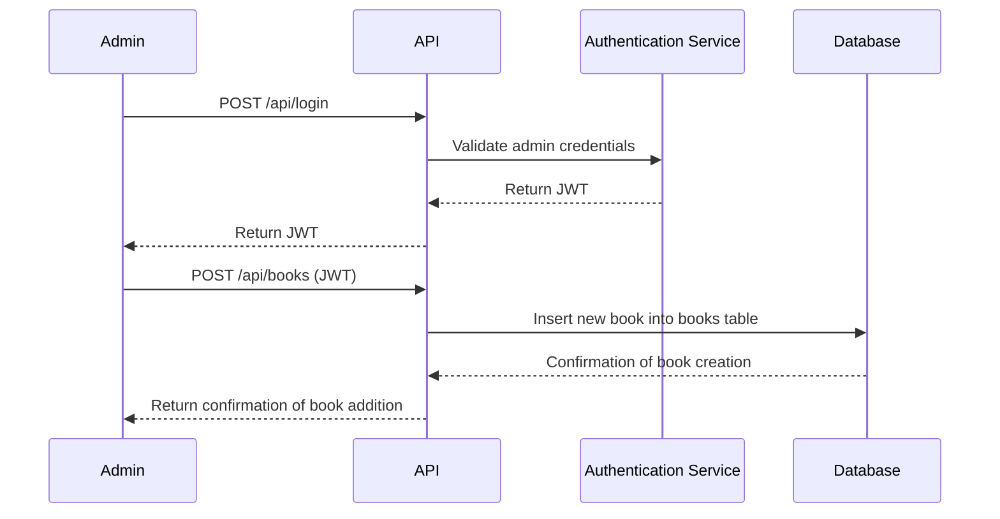

### Create an Account and Login

```mermaid
sequenceDiagram
    participant User
    participant API
    participant DB as Database

    User->>API: POST /api/register
    API->>DB: Insert new user into users table
    DB-->>API: Registration success
    API-->>User: Return registration confirmation

    User->>API: POST /api/login
    API->>DB: Verify email and password
    DB-->>API: Authentication success, return user data
    API-->>User: Return JWT

```

### Borrow a Book

```mermaid
sequenceDiagram
    participant User
    participant API
    participant AuthService as Authentication Service
    participant DB as Database

    User->>API: POST /api/login
    API->>AuthService: Validate credentials
    AuthService-->>API: Return JWT
    API-->>User: Return JWT

    User->>API: POST /api/borrow (JWT)
    API->>DB: Update borrow table, set book as borrowed
    DB-->>API: Confirmation of borrow action
    API-->>User: Return borrow confirmation

```

### Return a Book

```mermaid
sequenceDiagram
    participant User
    participant API
    participant DB as Database

    User->>API: POST /api/return (JWT, Book ID)
    API->>DB: Update borrow table to set return date
    DB-->>API: Confirmation of return action
    API-->>User: Return confirmation of book return

```

### Add a Book (Admin only)

```mermaid
sequenceDiagram
    participant Admin
    participant API
    participant AuthService as Authentication Service
    participant DB as Database

    Admin->>API: POST /api/login
    API->>AuthService: Validate admin credentials
    AuthService-->>API: Return JWT
    API-->>Admin: Return JWT

    Admin->>API: POST /api/books (JWT)
    API->>DB: Insert new book into books table
    DB-->>API: Confirmation of book creation
    API-->>Admin: Return confirmation of book addition

```

## Notes
- The Authentication service is a part of the API, not a separate service